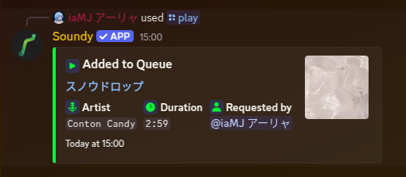
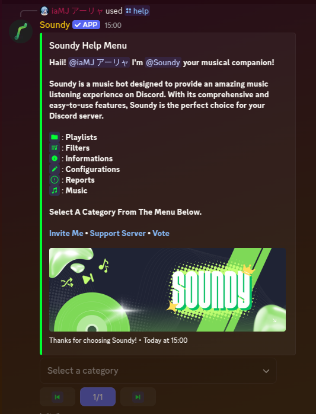

<div align="center">

# 🎵 Soundy

[](https://discord.dev/)
[](https://bun.sh/)
[](https://www.typescriptlang.org/)
[](https://turso.tech/)
[](LICENSE)

**A powerful, feature-rich Discord music bot built with [Seyfert](https://github.com/tiramisulabs/Seyfert) and [lavalink-client](https://github.com/Tomato6966/lavalink-client)**

*Enjoy seamless music streaming, advanced queue management, custom playlists, and more—all for free!*

[🚀 Invite Bot](https://discord.com/oauth2/authorize?client_id=1168385371294420992) • [🔥 Vote Bot](https://top.gg/bot/1168385371294420992/vote) • [💬 Support Server](https://discord.gg/pTbFUFdppU)

</div>

---

## ✨ Features

<div align="center">

| 🎶 **Music** | 🎛️ **Management** | 🔧 **System** |
|:---:|:---:|:---:|
| High-quality playback | Queue management | DJ & Premium system |
| Multiple sources | Custom playlists | Statistics & Charts |
| 24/7 Mode | Loop & Shuffle | Multi-language support |

</div>

### 🎵 **Music Features**
- 🎧 **High-quality music playback** from YouTube, Spotify, SoundCloud, and more
- 🔄 **Advanced queue management** - add, remove, sort, and manage songs
- 📝 **Custom playlists** - save and organize your favorite tracks
- 🔁 **Loop modes** - track, queue, and autoplay support

### 🎛️ **Control Features**
- 🎚️ **Volume control** with individual user preferences
- ⏭️ **Skip, pause, resume** with voting system
- 🔀 **Shuffle and seek** functionality
- 📊 **Real-time player updates** and now playing display

### 🔧 **System Features**
- 👑 **DJ & Premium system** - control access and unlock features
- 📈 **Statistics & Top Charts** - view song stats and top users
- 💬 **Dual command support** - slash commands (`/`) and custom prefix
- 🌍 **Multi-language support** - English default, easily extendable
- 🗳️ **Top.gg integration** - vote for extra features

---

## 🚀 Quick Start

### 📋 Prerequisites

<div align="center">

| Requirement | Version | Download |
|:---:|:---:|:---:|
| **Bun** | Latest | [Download](https://bun.sh/) |
| **Discord Bot** | - | [Create Bot](https://discord.com/developers/applications) |
| **Turso Database** | - | [Get Database](https://turso.tech/) |

</div>

### 🛠️ Installation

1. **📦 Clone the Repository**
   ```bash
   git clone https://github.com/idMJA/Soundy.git
   cd Soundy
   ```

2. **⬇️ Install Dependencies**
   ```bash
   bun install
   ```

3. **💾 Setup Database (Turso)**
   
   > **📌 Important:** You need to set up a Turso database first before configuring the bot.

   <details>
   <summary><b>🔧 How to get Turso Database URL & Password</b></summary>
   
   ### Step 1: Create a Turso Account
   1. Go to [turso.tech](https://turso.tech/)
   2. Click **"Sign up"** and create your account
   3. Verify your email if required
   
   ### Step 2: Create a Database
   1. After logging in, click **"Create Database"**
   2. Choose a name for your database (e.g., `soundy-db`)
   3. Select your preferred region
   4. Click **"Create"**
   
   ### Step 3: Get Database Credentials
   1. In your database dashboard, click on your newly created database
   2. Navigate to the **"Overview"** tab
   3. Copy the **Database URL** (starts with `libsql://`)
   4. Go to **"Settings"** tab
   5. Click **"Create Token"** to generate a new auth token
   6. Copy the generated token (this is your `DATABASE_PASSWORD`)
   
   ### Example URLs:
   ```
   DATABASE_URL=libsql://your-database-name.turso.io
   DATABASE_PASSWORD=your-auth-token-here
   ```
   
   </details>

4. **⚙️ Configure Environment Variables**
   
   Rename `.env.example` to `.env` and fill out the variables:
   
   ```env
   # Discord Bot Configuration
   TOKEN=your_discord_bot_token_here
   
   # Turso Database Configuration
   DATABASE_URL=libsql://your-database-name.turso.io
   DATABASE_PASSWORD=your-turso-auth-token
   
   # Last.fm API (Optional - for lyrics and music data)
   LASTFM_API_KEY=your_lastfm_api_key # You can add multiple keys separated by commas for load balancing
   ```

5. **🔧 Configure Bot Settings**
   
   **a.** Update `src/config/config.ts` with your bot configuration
   
   **b.** Configure Lavalink nodes in `src/config/nodes.ts`
   
   **c.** Set up custom emojis in `src/config/emoji.ts`

6. **🚀 Start the Bot**
   ```bash
   bun start
   ```

---

## ⚙️ Configuration

<div align="center">

| Setting | Default | Description |
|:---:|:---:|:---|
| **Prefix** | `!` | Can be changed per server via prefix command |
| **24/7 Mode** | Disabled | Bot stays in voice channel continuously |
| **Voice Status** | Enabled | Updates voice channel status with current song |
| **Premium** | - | Additional features for premium users |

</div>

---

## 📸 Screenshots

<div align="center">

### 🎵 Music Player Interface



*Advanced music player with queue management and controls*

### 🎧 Now Playing Display


*Real-time now playing information with interactive controls*

### 📋 Help Command



*Comprehensive help system with command categories*

</div>

---

## 👥 Contributors

<div align="center">

| Avatar | Contributor | Role |
|:---:|:---:|:---:|
| [](https://github.com/idMJA) | **[iaMJ](https://github.com/idMJA)** | 🯠Creator of Soundy |
| [](https://github.com/88JC) | **[kydo](https://github.com/88JC)** | 🛠Bug Hunter |
| 🎵 | **[Lavamusic](https://github.com/appujet/lavamusic)** | 💡 Inspiration & Ideas |
| ⭐ | **[stelle-music](https://github.com/Ganyu-Studios/stelle-music)** | 🔧 Code Adaptation |

</div>

---

## 🤝 Contributing

We welcome contributions! Here's how you can help:

<div align="center">

| 🍴 **Fork** | 🌿 **Branch** | 🔧 **Code** | 📝 **PR** |
|:---:|:---:|:---:|:---:|
| Fork the repo | Create feature branch | Make your changes | Submit pull request |

</div>

### 📋 Contribution Guidelines

1. **Fork** the repository and create your branch from `master`
2. **Test** your changes thoroughly
3. **Follow** the existing code style and conventions
4. **Write** clear commit messages
5. **Submit** a pull request with a detailed description

### 🐛 Found a Bug?

[Report it here](https://github.com/idMJA/Soundy/issues) with detailed steps to reproduce.

---

## 📞 Support

<div align="center">

**Need Help? Join Our Community!**

[💬 Discord Server](https://discord.gg/pTbFUFdppU) • [📧 Email Support](mailto:kiyomi@mjba.my) • [📋 Documentation](https://github.com/idMJA/Soundy/wiki)

</div>

---

## 📄 License

<div align="center">

This project is licensed under the [**GNU Affero General Public License v3.0**](LICENSE)

**Copyright © 2025 Tronix Development. All rights reserved.**

For commercial use, contact [Tronix Development](https://discord.gg/pTbFUFdppU)

---

<sub>Made with ❤️ by the Tronix Development Team</sub>

</div>
